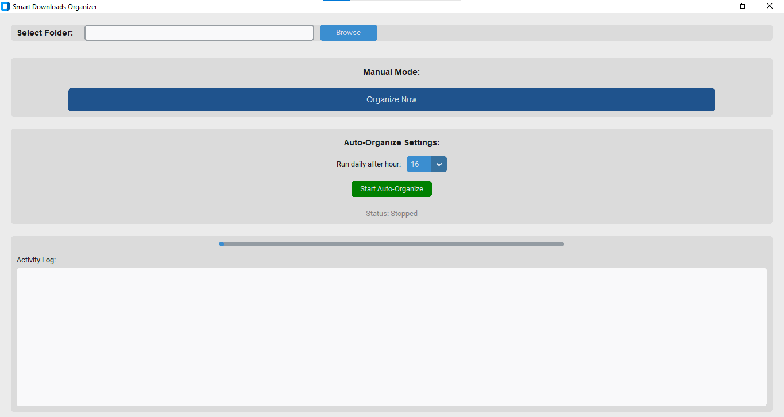
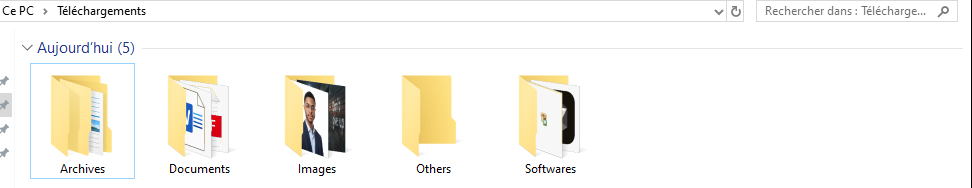

📂 Smart Downloads Organizer
A smart, modern desktop application to automate file organization and clean up your Downloads folder instantly.
📖 Description
Smart Downloads Organizer is a Python-based desktop application designed to solve the clutter of the "Downloads" folder.
It analyzes file extensions and automatically moves files into categorized subfolders (Images, Documents, Videos, Software, etc.). Built with CustomTkinter, it features a modern UI (Dark/Light mode support) and includes a Smart Auto-Mode that runs in the background to keep your workspace clean without manual intervention.
✨ Key Features
🎨 Modern UI: A sleek, user-friendly interface built with CustomTkinter.
⚡ One-Click Organization: Instantly sort an entire folder manually.
🤖 Smart Auto-Mode: Enable the background process to monitor and sort files daily at a specific time.
📂 Comprehensive Categorization:
Images (.jpg, .png, .gif, .webp...)
Documents (.pdf, .docx, .xlsx, .txt...)
Videos (.mp4, .mkv, .avi...)
Software/Installers (.exe, .msi...)
Archives, Music, Code, and more.
📝 Activity Logging: Keeps a detailed history of moved files in organize_log.txt.
🛡️ Duplicate Safety: Automatically handles duplicate filenames by renaming them (e.g., file(1).txt) instead of overwriting.
📸 Preview & Demo
The Interface (Dark Mode):

Before vs. After:

See the chaos turn into order in seconds.
🚀 Installation & Usage
Option A: Installer (Windows)
For users who just want to use the app without coding:
Go to the Releases section of this repository.
Download SmartOrganizer_Setup_v1.exe.
Install and run!
Option B: From Source (Developers)
Clone the repository:
git clone [https://github.com/YOUR_USERNAME/SmartDownloadsOrganizer.git](https://github.com/YOUR_USERNAME/SmartDownloadsOrganizer.git)
cd SmartDownloadsOrganizer

Install dependencies:
It is recommended to use a virtual environment.
pip install -r requirements.txt

Run the application:
python src/smart_organizer_ctk.py

🛠️ Build Instructions
To compile the application into a standalone .exe yourself:
1. Generate the Executable (PyInstaller):
Use this command to ensure CustomTkinter assets are included:
python -m PyInstaller --noconsole --onefile --name="SmartOrganizer" --collect-all customtkinter src/smart_organizer_ctk.py

2. Create the Installer (Inno Setup):
Open setup_script.iss with Inno Setup Compiler and build to generate the Setup wizard.
🏗️ Project Structure
SmartDownloadsOrganizer/
│
├── src/
│   ├── smart_organizer_ctk.py   # Main source code
│   ├── dist/                    # Compiled executables
│   └── setup_script.iss         # Inno Setup configuration
│
├── assets/                      # Screenshots and demo images
├── README.md                    # Documentation
└── requirements.txt             # Python dependencies

🤝 Contributing
Contributions are welcome!
Fork the project.
Create your feature branch (git checkout -b feature/AmazingFeature).
Commit your changes (git commit -m 'Add some AmazingFeature').
Push to the branch (git push origin feature/AmazingFeature).
Open a Pull Request.
📄 License
Distributed under the MIT License. See LICENSE for more information.
Developed  by [Marwan Outrgua](https://github.com/MarwanOutrgua)
